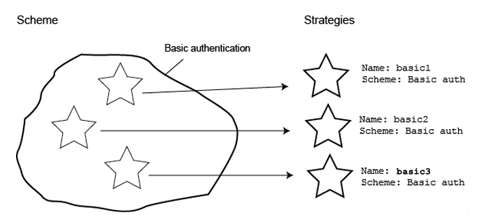

# week7-authentication-research

### Authentication

Authentication within hapi is based on the concept of `schemes` and `strategies`.

Think of a `scheme` as a general type of auth, like `"basic"` or `"digest"`. You can think of a scheme as a template for authentication. A scheme isn’t used directly to authenticate users - instead you create a specific strategy from the scheme.

Some authentication schemas are available as a plugin for HAPI:

* [hapi-auth-basic](https://github.com/hapijs/hapi-auth-basic)
* [hapi-auth-cookie](https://github.com/hapijs/hapi-auth-cookie)  Provides simple cookie-based session management. Upon validation user receives a session cookie.
* [hapi-auth-bearer-token](https://github.com/johnbrett/hapi-auth-bearer-token)
 
Bearer authentication requires validating a token passed in by either the bearer authorization header, or by an access_token query parameter.

A `strategy` is a pre-configured and named instance of a scheme. Strategies exist so you can use the same scheme several times, in a slightly different way. For instance, might decide to you want use basic authentication in your app. For some routes you might wish to validate a user’s passwords against a value in a database and for some other routes, you might wish to check the password against a value stored in a text file. In this case you can create 2 different strategies from the scheme.

The authenticate method has a signature of `function (request, reply)`, and is the only required method in a scheme.

## Bcrypt

### Hashing

Hashing is a way of encrypting an input string. It is a one way process, so hashing a password will  An ideal hash function has five properties:

1. It is deterministic (the same input always results in the same output hash).
2. Computing a hash is fast.
3. It is infeasible to reverse the process and get the input value from the hash (i.e. usually the only method is brute-forcing by comparing every possible value until a match is found, which takes huge amounts of time for a long enough hash).
4. A small change to the input should change the hash enough that there is no correlation between the new and old hashes.
5. It is unlikely that two inputs will produce the same hash value.

### Salting

Salting involves adding random data to the input to the hashing function, to protect against certain kinds of attacks (like dictionary or rainbow table attacks).

Since salts do not have to be memorised by humans they can make the size of the rainbow table required for a successful attack prohibitively large without placing a burden on the users.

Since salts are different in each case, they also protect commonly used passwords, or those who use the same password on several sites, by making all salted hash instances for the same password different from each other.

### Practical application

Bcrypt is a library for hashing passwords. It provides functions for salting and hashing a plaintext password string.

The general idea is to hash a password when a user first creates it, then store the hashed password in a database. When the user tries to log in later you hash the password they provide and compare this hash to the stored hash in the database. If the hashes match that means the passwords are the same, so the user is authenticated.

### Hapi-auth-basic
https://github.com/hapijs/hapi-auth-basic

- Basic authentication requires validating a username and password combination.

### Glossary

- **Scheme** - *a general type of auth, like "basic" or "digest"*
  - A scheme is a method with the signature `function (server, options)`. The server parameter is a reference to the server the scheme is being added to, while the options parameter is the configuration object provided when registering a strategy that uses this scheme.
  - To register a scheme, use either `server.auth.scheme(name, scheme)`. The name parameter is a string used to identify this specific scheme.
- **Strategy** - *a pre-configured and named instance of a scheme.*
  - Once you've registered your scheme, you need a way to use it. This is where strategies come in.
  - To register a strategy, we must first have a scheme registered. Once that's complete, use `server.auth.strategy(name, scheme, [mode], [options])` to register your strategy.

### Resources

[Bcrypt docs](https://www.npmjs.com/package/bcrypt)

[Authentication tutorial](https://hapijs.com/tutorials/auth)
